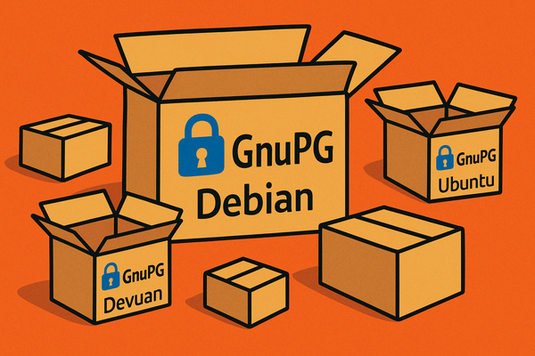

#+LANGUAGE: en
#+TITLE: New GnuPG Repositories for Debian, Ubuntu, and Devuan: Stable and Development Branches Available
# Artikel zu den neuen Repos
#+STARTUP: showall
#+AUTHOR: Heike Jurzik
#+DATE: August 27, 2025
#+KEYWORDS: GnuPG, 2.5.x, 2.4.x, OpenPGP, Debian, Ubuntu, Devuan, package source, repository, encryption, IT security, GpgME, Libgcrypt, Libassuan, Libksba, libgpg-error, open source, Linux
#+SUMMARY: The new GnuPG repositories are online. Up-to-date packages for Debian, Ubuntu, and Devuan are available in the stable and development branches–including OpenPGP, Libgcrypt, GpgME, and more. Directly maintained by the GnuPG Project.

** New GnuPG Repositories for Debian, Ubuntu, and Devuan: Stable and Development Branches Available

#+HTML: 
<em>Last updated: July 23, 2026. See the changelog at the end of the article for details.</em>

#+ATTR_HTML: :class figure :alt GnuPG packages for Debian, Ubuntu, and Devuan

If you use GnuPG for production systems or testing environments,
you've likely run into this: many Linux distributions ship older or
heavily modified versions—with patches that diverge significantly
from upstream code. To change that, we're now offering our own
[[https://repos.gnupg.org/deb/][official repositories]] with stable
releases and development builds—free from distribution-specific tweaks,
and exactly as intended by the upstream team.

# TODO: Reactivate this block once 2.6/2.7 are real (update version numbers)
# You can choose between two active branches:
# - 2.4.x: reached its end of life on June 30, 2026
# - 2.5.x: currently recommended for production use (stable), and also serves as the development version due to still-incomplete PQC support (Kyber)

Version 2.5.x is currently recommended for production use (stable).
Version 2.4.x reached its end of life on June 30, 2026. Because PQC
support (Kyber) in 2.5.x is not yet complete, this branch also serves
as the development version for now.

These repositories include all core components: =gpg=, =gpg-agent=,
=scdaemon=, =libgcrypt=, =libgpgme=, and =gpg-wks-client=. In this
article, we'll walk you through adding the repositories, importing
the signing key, and installing GnuPG cleanly on your system.

*** GnuPG Package Sources at a Glance

All package sources listed here come from our own repository at
[[https://repos.gnupg.org/deb/gnupg/][repos.gnupg.org/deb/gnupg/]]
and are grouped by distribution and release branch. To see which GnuPG
version a repository currently provides, check its directory listing.

| Distribution | Branch      | Link                                                            |
|--------------+-------------+------------------------------------------------------------------|
| Devuan       | Development | [[https://repos.gnupg.org/deb/gnupg/daedalus-devel/][daedalus-devel]] |
| Devuan       | Stable      | [[https://repos.gnupg.org/deb/gnupg/daedalus/][daedalus]]       |
| Debian       | Development | [[https://repos.gnupg.org/deb/gnupg/bookworm-devel/][bookworm-devel]] |
| Debian       | Development | [[https://repos.gnupg.org/deb/gnupg/trixie-devel/][trixie-devel]]   |
| Debian       | Stable      | [[https://repos.gnupg.org/deb/gnupg/bookworm/][bookworm]]       |
| Debian       | Stable      | [[https://repos.gnupg.org/deb/gnupg/trixie/][trixie]]         |
| Ubuntu       | Development | [[https://repos.gnupg.org/deb/gnupg/jammy-devel/][jammy-devel]]    |
| Ubuntu       | Development | [[https://repos.gnupg.org/deb/gnupg/noble-devel/][noble-devel]]    |
| Ubuntu       | Development | [[https://repos.gnupg.org/deb/gnupg/resolute-devel/][resolute-devel]] |
| Ubuntu       | Stable      | [[https://repos.gnupg.org/deb/gnupg/jammy/][jammy]]          |
| Ubuntu       | Stable      | [[https://repos.gnupg.org/deb/gnupg/noble/][noble]]          |
| Ubuntu       | Stable      | [[https://repos.gnupg.org/deb/gnupg/resolute/][resolute]]       |

#+HTML: 

*Note:* The stable 2.4.x series reached its end of life on June 30,
2026. 2.5.x currently serves as both the stable and the development
branch, until PQC support there is fully complete. After that, the
previously announced split into 2.6 (stable) and 2.7 (development)
will follow. To see which version a repository currently provides,
check its directory listing.
#+HTML: 

*** Importing and Saving the GnuPG Signing Key

First things first: you'll need to import the signing key for the GnuPG
repository. The easiest way is to use an existing GnuPG installation
and run the following command:

#+begin_src
sudo gpg \
  --no-default-keyring \
  --keyring /usr/share/keyrings/gnupg-keyring.gpg \
  --fetch-keys https://repos.gnupg.org/deb/gnupg/<repo>/gnupg-signing-key.gpg
#+end_src

Replace =<repo>= with the codename of your distribution—for example,
=bookworm= or =trixie-devel= (Debian), =daedalus= (Devuan), or =jammy=,
=noble=, and =resolute= (Ubuntu), each with or without the =-devel=
suffix. To see which version a repository currently provides, check
its directory listing.

After running the command, you should see output similar to this:

#+begin_src
gpg: keybox '/usr/share/keyrings/gnupg-keyring.gpg' created
gpg: requesting key from 'https://repos.gnupg.org/deb/gnupg/trixie-devel/gnupg-signing-key.gpg'
gpg: key 85C45AE3E1A2B355: public key "GnuPG.org Package Signing Key <package-maintainers@gnupg.org>" imported
gpg: Total number processed: 1
gpg:               imported: 1
#+end_src

Prefer using =curl= or =wget=? No problem—you can download the key
manually, too.

**** Download using =wget=:

#+begin_src
wget -O- https://repos.gnupg.org/deb/gnupg/<repo>/gnupg-signing-key.gpg | \
  sudo gpg --dearmor --yes --output /usr/share/keyrings/gnupg-keyring.gpg
#+end_src

**** Download using =curl=:

#+begin_src
curl https://repos.gnupg.org/deb/gnupg/<repo>/gnupg-signing-key.gpg | \
  sudo gpg --dearmor --yes --output /usr/share/keyrings/gnupg-keyring.gpg
#+end_src

*** Check Permissions: Make Sure the GnuPG Key Is Readable

After downloading the key, double-check that the file is readable by all
users on the system. Otherwise, your package manager won't be able to
access it. The output should look something like this:

#+begin_src
$ ls -la /usr/share/keyrings/gnupg-keyring.gpg
-rw-r--r-- 1 root root 1100 Jun 24 13:33 /usr/share/keyrings/gnupg-keyring.gpg
#+end_src

This means the file is owned by =root= and has the permissions
=rw-r--r--=—read and write access for the owner, and read-only access
for everyone else. That's exactly what you want in this case.

If those read permissions are missing (for example, the file is marked
=rw-------=), =apt= won't be able to use it, and adding the repository
will fail. In that case, you can fix the permission with:

#+begin_src
sudo chmod a+r /usr/share/keyrings/gnupg-keyring.gpg
#+end_src

This makes the file readable by all users on the system—a necessary
step for your package manager to do its job.

*** Add the GnuPG Repository as a Trusted Source

Next, you'll need to add the GnuPG repository to your system's package
manager. To do this, create a new configuration file that points to the
repository and references the signature key. Run the following command:

#+begin_src
echo "Types: deb
URIs: https://repos.gnupg.org/deb/gnupg/<repo>/
Suites: <suite>
Components: main
Signed-By: /usr/share/keyrings/gnupg-keyring.gpg" |
sudo tee /etc/apt/sources.list.d/gnupg.sources
#+end_src

Replace =<repo>= with the full repository name, for example:

- =daedalus= or =daedalus-devel=
- =bookworm= or =bookworm-devel=
- =trixie= or =trixie-devel=
- =jammy= or =jammy-devel=
- =noble= or =noble-devel=
- =resolute= or =resolute-devel=

This determines whether you use the stable branch or the development
branch (=devel=).

For =<suite>=, always enter only the distribution name without =-devel=,
for example:

- =daedalus=
- =bookworm=
- =trixie=
- =jammy=
- =noble=
- =resolute=

**** What Does This Do?

- =Types: deb=: Tells the package manager that this is a binary Debian repository (i.e., it contains =.deb= packages, not source packages).

- =URIs: https://repos.gnupg.org/deb/gnupg/<repo>/=: This is the actual URL of the GnuPG repository.

- =Suites: <suite>= specifies the target distribution for APT, while the repository path itself (=<repo>=) determines whether stable or development packages are used.

- =Components: main=: The repository only has one section, =main=—which is common for upstream repositories.

- =Signed-By: /usr/share/keyrings/gnupg-keyring.gpg=: Points to the trusted GPG key used to verify packages from this source (the one you just imported).

The use of =sudo tee= writes this configuration to a file
named =gnupg-devel.sources= inside the =/etc/apt/sources.list.d/=
directory. That's the recommended location for additional repositories
on Debian-based systems—clean, standard, and easy to manage.

*** Installing GnuPG: Update Package Lists and Choose a Version

Once the repository is set up and the signing key has been imported,
you can update your package lists using =apt update=:

#+begin_src
$ sudo apt update
#+end_src

This command pulls the latest package information from all configured
sources—including the GnuPG repository.

Before installing, it's a good idea to check package priorities and
make sure you're actually getting the version you want. To do that,
inspect the current package status:

#+begin_src
$ apt policy gnupg2
gnupg2:
  Installed: 2.2.40-1.1
  Candidate: 2.2.40-1.1
  Version table:
     2.5.9-1 500
        500 https://repos.gnupg.org/deb/gnupg/bookworm-devel trixie/main amd64 Packages
 *** 2.2.40-1.1 900
        900 http://deb.debian.org/debian bookworm/main amd64 Packages
        100 /var/lib/dpkg/status
#+end_src

=apt= shows both the currently installed version and all available
alternatives—along with their respective priorities. If, for example,
the default version has a priority of 900 and the GnuPG repository
version is listed with 500, a regular =apt upgrade= will still prefer
the older version.

To install or upgrade to the newer version (2.4.8 or 2.5.9), you need
to explicitly select the desired source. The easiest way to do that is:

#+begin_src
sudo apt install -t <suite> gnupg2
#+end_src

Here, =<suite>= refers to the repository name in your =sources= file,
for example, =bookworm=, =trixie=, =jammy=, or =daedalus=. This command
ensures that =apt= installs not just =gnupg2=, but also all related
components like =gpg-agent=, =dirmngr=, =libgcrypt=, and others from
the new repository.

In some cases, both versions may have the same priority—typically
500. When that happens, =apt= won't choose based on relevance but will
simply go with the newer version available, usually from the newly added
repository. The upgrade will then happen automatically during the next
regular =apt upgrade=.

#+HTML: 

*Note:* If you're using a smartcard, make sure to install the =scdaemon=
package manually—it's not pulled in automatically.
#+HTML: 

*** Check your GnuPG version: Verifying the installation

Once the installation is complete, it's worth taking a moment to confirm
that your system is actually using the new GnuPG version. Just run:

#+begin_src
gpg --version
#+end_src

The output shows the installed version number, the cryptographic library
used (=libgcrypt=), the supported algorithms, and the path to the GnuPG
home directory.

After upgrading to version 2.5.9, you might see something like this:

#+begin_src
gpg (GnuPG) 2.5.9
libgcrypt 1.11.1
[...]
Supported algorithms:
Pubkey: RSA, Kyber, ELG, DSA, ECDH, ECDSA, EDDSA
Cipher: IDEA, 3DES, CAST5, BLOWFISH, AES, AES192, AES256, TWOFISH,
        CAMELLIA128, CAMELLIA192, CAMELLIA256
Hash: SHA1, RIPEMD160, SHA256, SHA384, SHA512, SHA224
Compression: Uncompressed, ZIP, ZLIB, BZIP2
#+end_src

Notably, version 2.5.9 includes Kyber in the list of supported
algorithms—a quantum-resistant key exchange method introduced with
GnuPG 2.5. This marks a major step forward, giving you access to a
significantly more modern cryptographic architecture.

*** gpg-agent and dirmngr with GnuPG 2.4.x and 2.5.x: Restart and Check

The =gpg-agent= is a key part of GnuPG. It manages passphrases, talks
to smartcards, and provides several interfaces via Unix sockets. Its
companion, =dirmngr=, handles tasks like fetching keys and certificates
behind the scenes.

After installing the new version, it's worth taking a quick look at both
components—especially since their behavior has changed: our packages
no longer use =systemd= integration. That means =gpg-agent= and =dirmngr=
are no longer managed through =systemctl --user=, but instead run the
traditional way—launched directly by GnuPG when needed.

To check if the agent is currently running, use:

#+begin_src
$ gpgconf --list-dirs agent-socket
/run/user/1000/gnupg/S.gpg-agent
#+end_src

Should you run into issues after installation or configuration
changes—for example, a warning like:

#+begin_src
gpg: WARNING: server 'dirmngr' is older than us (2.4.7 < 2.5.9)
#+end_src

—it usually means an older background process is still running.

In that case, the easiest fix is to stop all GnuPG components at once:

#+begin_src
gpgconf --kill all
#+end_src

This is the recommended way to cleanly restart everything after an
upgrade. GnuPG will automatically relaunch the necessary services,
in the correct version and configuration.

#+HTML: 

*Note:* If you were previously using GnuPG 2.2.x, systemd units for
=gpg-agent= or =dirmngr= might have been active. These are removed
automatically when upgrading to 2.4.x or 2.5.x—no manual cleanup
needed. A command like =systemctl --user list-unit-files | grep gpg-agent=
should return nothing.
#+HTML: 

*** Support and Feedback: Join the Conversation

If you run into issues while testing the packages or just
want to connect with others, feel free to subscribe to the
[[https://lists.gnupg.org/mailman/listinfo/gnupg-users][GnuPG-Users]]
mailing list or start a discussion with other users in our
[[https://forum.gnupg.org/c/gnupg][GnuPG forum]].

If you discover a bug, please don't report it through your
distribution's bug tracker—report it directly to the
[[https://www.gnupg.org/documentation/bts.html][GnuPG team]] instead.

*** Changelog

- July 23, 2026: Updated branch status: 2.4.x reached its end of life on June 30, 2026; 2.5.x is now stable and also serves as the development branch until the 2.6/2.7 split.
- July 23, 2026: Removed the version series column from the repository table, since the stable and development branches currently provide the same version; check the directory for the current version.
- July 23, 2026: Replaced the Ubuntu entry =plucky= with =resolute= (table, repository lists, body text), since the =plucky= repository no longer exists.
- July 23, 2026: Removed outdated version numbers from the signing key instructions, added a reference to the relevant directory instead.
